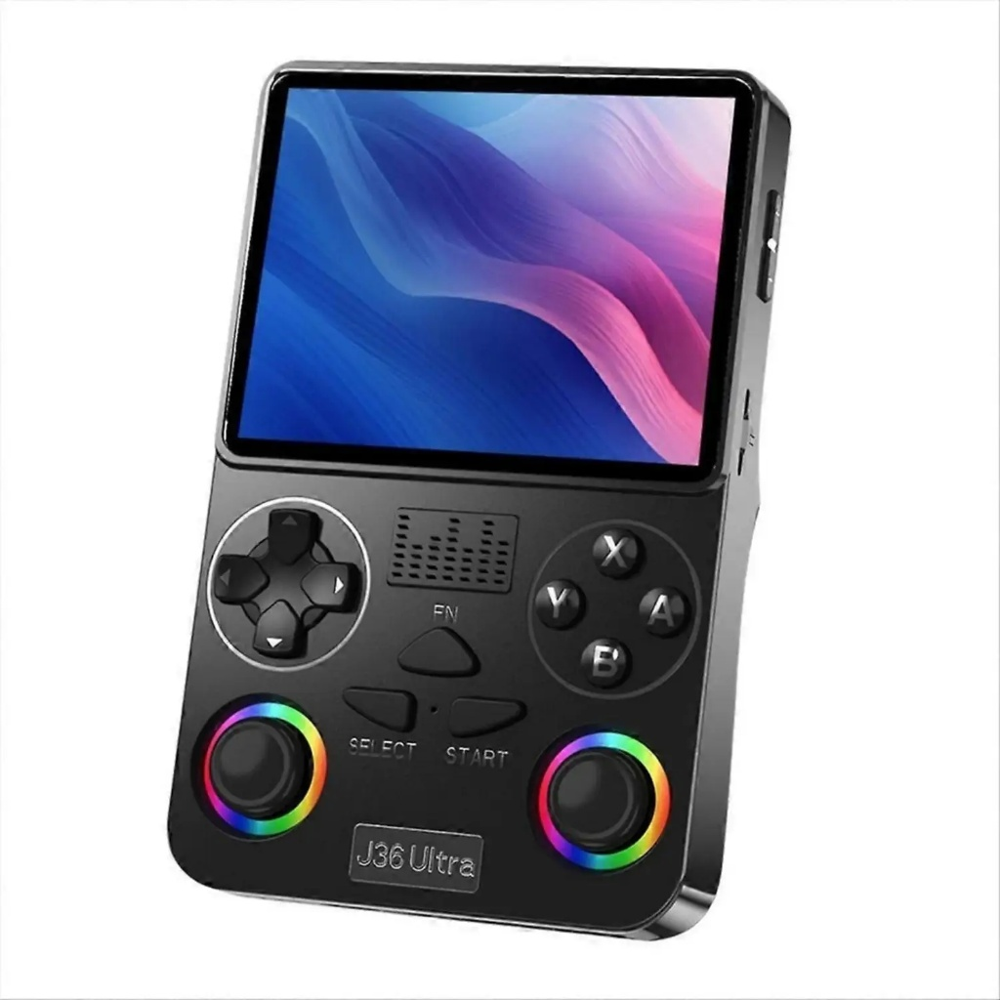

# VAYUDEX

My super cool DIY secret-agent cyber console! It is kind of like a Flipper Zero, but way more powerful, cheaper, and shaped like a retro handheld game console. (end product will look like this this like the inspiration of the console, like a console ,sorry it is a console!)

## What is this?
I always wanted a Flipper Zero to play with invisible radio waves, open gates, and tap school ID cards, but it was way too expensive to buy in India. So I decided to just build my own! 

Instead of an old-school orange screen, VAYUDEX has a big bright colorful screen with real gaming buttons. Inside, it can listen to radio remotes, talk to cards, control TVs with invisible light, and connect to Wi-Fi!

## What parts make it work?
* **Super Brain (ESP32-S3):** A crazy fast computer chip with Wi-Fi and Bluetooth that runs everything.
* **Big Color Screen:** A 3.5-inch screen with full colors so menus look like a real game.
* **Secret Radio Antenna (CC1101):** Catches radio signals from garage remotes and wireless doorbells through the air.
* **Magic Card Tapper (PN532):** Reads and copies tap-to-pay style smart cards and tags.
* **Old-School Badge Reader:** Picks up older key fobs and building entry cards.
* **Invisible TV Blaster:** A tiny infrared light that can change channels or turn off TVs from across the room.
* **Computer Prank / Typer (BadUSB):** Plugs into a computer using USB and types super fast like a robot.
* **Rechargeable Battery:** A flat battery inside that charges up with a normal USB-C phone cable.
* **Game Buttons:** A D-pad plus A, B, X, Y buttons and thumbsticks so it feels just like playing a Game Boy.

## What is inside this folder?
* `/schematics`: The blueprint drawings showing how all the wires and chips connect together.
* `/firmware`: The code I wrote to make the buttons work and draw the menus on screen.
* `/cad`: The 3D files to print out the plastic shell so all the parts fit inside.
