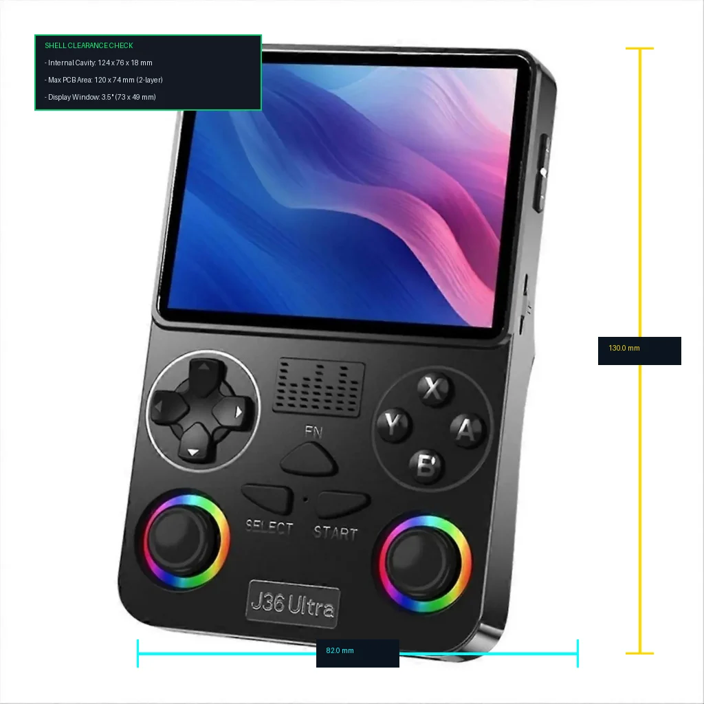

# VAYUDEX

A vertical, handheld multi-protocol wireless security and auditing terminal inspired by the Flipper Zero, built around the ESP32-S3.

  

## Overview
VAYUDEX combines Sub-1 GHz RF, NFC, 125 kHz RFID, Infrared transmission, and BadUSB automation into a dedicated portable portrait console form factor. Powered by a 240 MHz dual-core ESP32-S3 with 8MB Octal PSRAM and a 3.5-inch color IPS display, VAYUDEX features native Wi-Fi/BLE network analysis, DMA-buffered signal logging, and an integrated power management system.

## Hardware Specifications
* **Microcontroller:** ESP32-S3-WROOM-1 (Dual-Core Xtensa LX7 @ 240 MHz, 8MB Flash, 8MB PSRAM)
* **Display:** 3.5-inch IPS Color Panel (ST7796 driver, 480x320 resolution, dedicated 40MHz SPI)
* **Sub-1 GHz Transceiver:** TI CC1101 (315/433/868 MHz) + 433MHz helical spring antenna with discrete LC balun
* **NFC (13.56 MHz):** PN532 Breakout (Read/Write/Emulate ISO14443A/Mifare)
* **Low-Frequency RFID (125 kHz):** RDM6300 + external wire-wound resonant coil frontend
* **Infrared System:** 940 nm High-Power IR LED driven by 2N2222 NPN BJT + TSOP38238 38kHz demodulator
* **Storage Interface:** Push-push MicroSD socket operating via native 1-bit SDMMC DMA host
* **USB & HID:** Native ESP32-S3 USB OTG (BadUSB / DuckyScript execution) + USBLC6-2SC6 ESD clamp protection
* **Power Subsystem:** 3.7V 2500mAh 1S LiPo pouch battery + TP4056 USB-C charging circuit + AP2112K-3.3 ultra-low-dropout regulator
* **Controls:** 4-Way tactile D-pad + A/B/X/Y gaming button cluster with 10k pull-ups and 100nF RC debouncing

## Repository Structure
* `/docs/images`: Hardware architecture diagrams, schematics, KiCad DRC passes, and mechanical stackup renders
* `/schematics`: Hardware pinout allocation matrices and connection mapping
* `/firmware`: Microcontroller startup code, SPI bus isolators, and 1-bit SDMMC driver initialization
* `bom.csv`: Complete Tier 2 Bill of Materials ($65.00 funding allocation)
